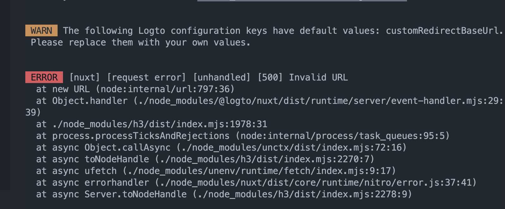
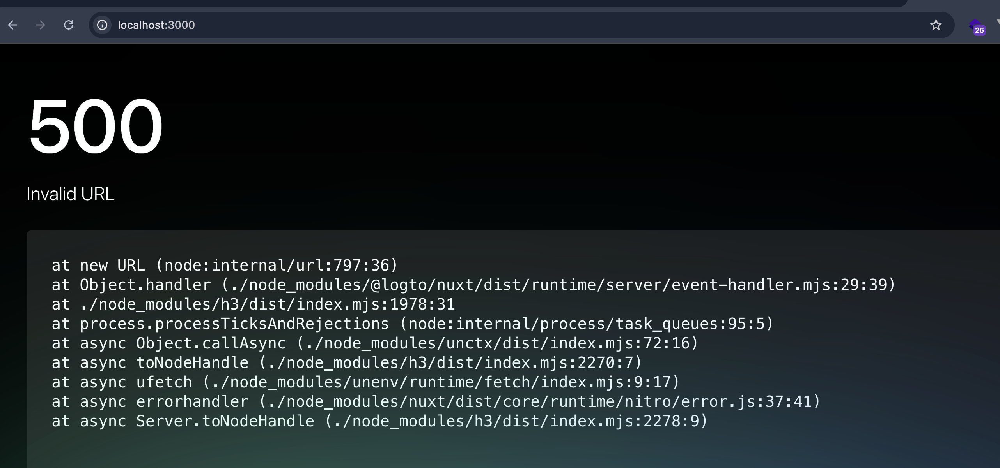

# Nuxt Logto 1.0.0

To create this repository, I used the following commands:

```bash
npx nuxi@latest init logto-nuxt
cd logto-nuxt
npm install @logto/nuxt
```

Following the official guide [Logto Quick Start for Nuxt](https://docs.logto.io/quick-starts/nuxt/) up until [Implement Sign-in and Sign-out](https://docs.logto.io/quick-starts/nuxt/#implement-sign-in-and-sign-out) i implemented what is needed in nuxt.config.js and .env file.

The `app.vue` is taken from the example in the playground:

[github.com/logto-io/js/packages/nuxt/playground/app.vue](https://github.com/logto-io/js/blob/81e7884c2a10f4db8dc0ba020d44ade9f6eb5c52/packages/nuxt/playground/app.vue)

After running `npm run dev`, I get the following errors:

**Server Error:**



**Browser Error:**



## If you downgrade logto version from 1.0.0 to the prevous 0.3.4 it works fine
